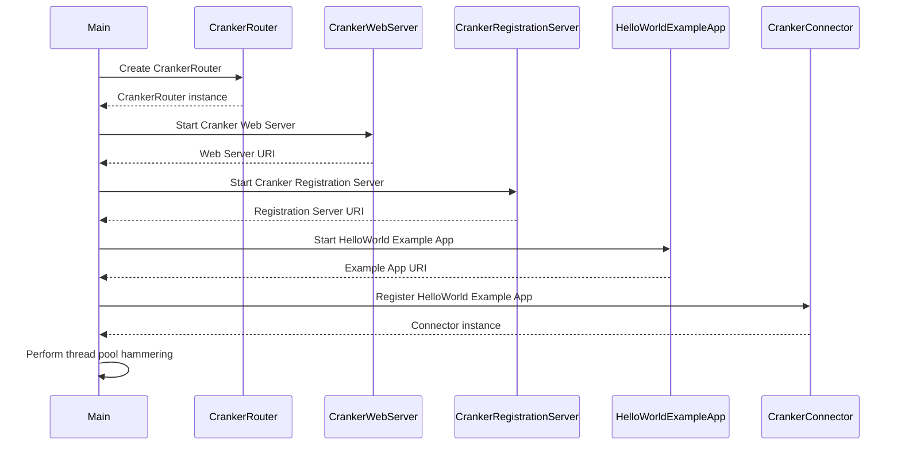

# Mu and Cranker (demo project)

Cranker-Router (a reverse-reverse proxy (or a tunnel)) and a Mu hello-world endpoint in a single project, with some 
built-in load testing.

You would use Cranker instead of an Apache or Nginx reverse-proxy.  

Read more on Cranker-Router: https://github.com/hsbc/mu-cranker-router
And Cranker Connector: https://github.com/hsbc/cranker-connector
And Mu https://github.com/3redronin/mu-server

Mu, for the Hello World endpoint, could be swapped for SpringBoot and equivalents.

Run the demo like so: 

```java
mvn compile exec:java
```

It is going to run 400,000 requests to the endpoint indirectly through Cranker-Router, then prints out a bunch of stats 
to the console. You'll have to ctrl-c it, as it leaves up the endpoints for you to play with in a regular browser.

## Setup Sequence Diagram

This should help you understand the reverse-reverse aspect of Cranker-Router 


