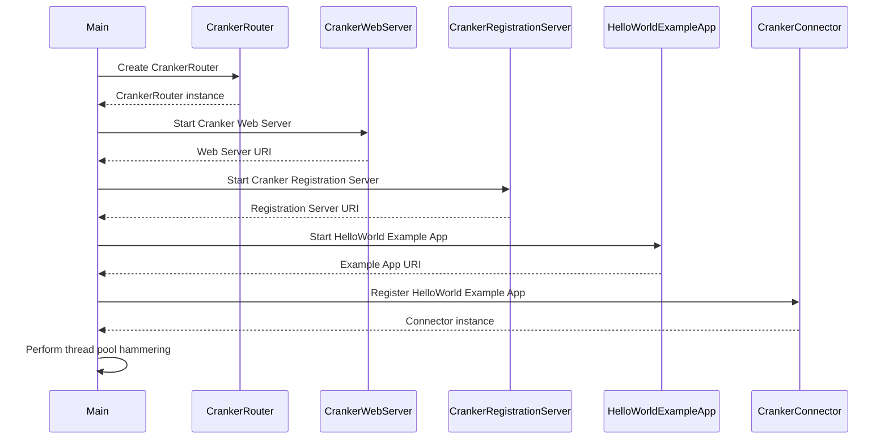

# Project Setup

This project demonstrates the setup of various components using a sequence diagram.

## Setup Sequence Diagram

```mermaid
sequenceDiagram
    participant Main
    participant CrankerRouter
    participant CrankerWebServer
    participant CrankerRegistrationServer
    participant HelloWorldExampleApp
    participant CrankerConnector

    Main->>CrankerRouter: Create CrankerRouter
    CrankerRouter-->>Main: CrankerRouter instance

    Main->>CrankerWebServer: Start Cranker Web Server
    CrankerWebServer-->>Main: Web Server URI

    Main->>CrankerRegistrationServer: Start Cranker Registration Server
    CrankerRegistrationServer-->>Main: Registration Server URI

    Main->>HelloWorldExampleApp: Start HelloWorld Example App
    HelloWorldExampleApp-->>Main: Example App URI

    Main->>CrankerConnector: Register HelloWorld Example App
    CrankerConnector-->>Main: Connector instance

    Main->>Main: Perform thread pool hammering
```
